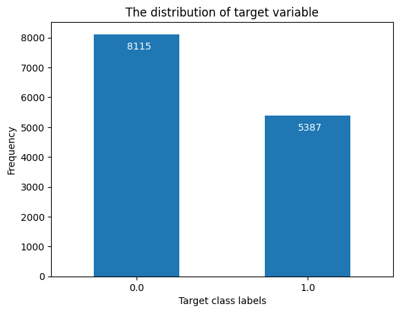

# Early Detection of Viral Epidemics using Machine Learning

## Introduction

Infectious disease outbreaks represent an ongoing concern for hospitals worldwide, posing significant risks to both patients and staff members. Addressing this challenge requires the development of robust early detection procedures to swiftly identify and mitigate potential viral infections. In this project, I aim to harness the power of machine learning to create predictive models tailored to the specific needs of hospitals, particularly focusing on the case study of the Lechi hospital's recent viral epidemic.

The primary objective of this project is to construct a binary classification model capable of accurately discerning between infected and non-infected individuals. By analyzing a diverse array of demographic and clinical attributes, my model seeks to provide hospitals with a valuable tool for preemptive intervention, enabling timely implementation of targeted contingency measures.

### Dataset Description

The dataset contains information on patients and staff within a hospital setting, including demographic and clinical attributes. An overview of the explanatory variables is provided in the following table:

The target attribute indicates whether an individual is infected (1) or not infected (0).

## Exploratory data analysis and Preprocessing

Exploratory Data Analysis (EDA) is a crucial step in any data science project, including data science projects aimed at predictive modeling, such as this one. It involves the initial exploration and examination of the dataset to gain insights into its structure, characteristics, and potential issues. EDA serves multiple purposes, including understanding the data at hand, identifying patterns and relationships, detecting anomalies or outliers, and determining the appropriate preprocessing steps needed to prepare the data for analysis and modeling.

Preprocessing, which often goes hand in hand with EDA, involves cleaning and transforming the data to address any issues identified during the exploratory phase. This may include handling missing values, encoding categorical variables, scaling numerical features, and addressing data imbalance, among other tasks. By conducting thorough preprocessing, we ensure that the data is in a suitable format for analysis and modeling, thus improving the accuracy and reliability of the results obtained from our predictive models.

### Handling missing values

During the exploratory data analysis phase, it was observed that missing values in the dataset are indicated as "?" in certain columns. To facilitate data manipulation and analysis, the first step in handling missing values is to convert these "?" values to NaN (Not a Number) in Python. This allows for easier handling of missing data using existing functions and libraries.

Upon further investigation, it was determined that three columns in the dataset contain missing values. Each column was treated differently based on the nature of the missing values and the specific characteristics of the data. Various strategies were employed to handle missing values, including:

- **Replacing missing values**: For columns where missing values could be reasonably inferred or replaced, such as categorical variables with a predominant category, missing values were replaced with appropriate values. For example, the most frequent category or a specific value based on domain knowledge.
- **Dropping samples**: In cases where missing values could not be reliably imputed or replaced, and the number of missing values was small relative to the size of the dataset, samples containing missing values were dropped from the dataset. This approach helps maintain the integrity of the dataset while minimizing data loss.

After applying the appropriate strategies to handle missing values, a thorough check was conducted to ensure that no missing values remained in the dataset. This validation step is crucial to guarantee the integrity and quality of the data for subsequent analysis and modeling tasks.

By effectively addressing missing values in the dataset, we ensure that our analyses and predictive models are based on complete and reliable data, thereby enhancing the accuracy and validity of our results.

### Data Exploration and Visualization

In this section, we conduct exploratory data analysis (EDA) through visualization techniques to gain deeper insights into the dataset's characteristics and identify potential patterns or trends that may inform our subsequent analyses and modeling efforts.

Let’s explore some examples. One aspect of interest in our dataset is whether the 'age' variable could serve as a good explanatory variable for our predictive models. We can visually examine this using some simple plots. By plotting a boxplot of 'age' grouped by the target variable, we observe any shifts or differences in the age distribution between different target groups. For example, a slight shift in the age distribution between groups suggests that 'age' might be a good predictor as shown below:

Alternatively, we can visualize the age distribution using a histogram overlaid with a density plot, providing a more detailed view of any shifts or differences between target groups:

By examining these visualizations, we can assess the potential predictive power of the 'age' variable and its relevance to our modeling efforts.

Similarly, we can explore categorical variables like 'speciality' to determine its predictive potential. We can visualize the distribution of 'speciality' categories across different target groups using a count plot:

By analyzing the count plot, we can identify any differences or patterns in the distribution of 'speciality' categories among target groups. Any noticeable distinctions suggest that the 'speciality' variable may carry valuable information for our predictive models, 
helping distinguish between different target outcomes.

Through these visual explorations, we gain valuable insights into potential explanatory variables and predictive features within our dataset, guiding our subsequent modeling efforts.

### Categorical variable encoding

In many real-world datasets, categorical variables play a significant role in capturing different aspects of the data. However, most machine learning algorithms require numerical input, which necessitates converting categorical variables into a suitable numerical format. This process, known as categorical variable encoding, allows us to represent categorical information in a way that can be effectively utilized by machine learning models.

- One common approach to encoding categorical variables is one-hot encoding, implemented in pandas using the ‘get_dummies()’ function. One-hot encoding creates binary columns for each category in a categorical variable, with a value of 1 indicating the presence of that category and 0 indicating its absence. This method is straightforward to implement and works well for categorical variables with a small number of unique categories.
- Another approach to encoding categorical variables is binary encoding, implemented in the ‘category_encoders’ library using the ‘BinaryEncoder’ transformer. Binary encoding reduces the dimensionality of categorical variables by representing each category with binary digits. This method is particularly useful for categorical variables with a large number of unique categories, as it can significantly reduce the number of features in the dataset compared to one-hot encoding.

Both approaches have their advantages and may be suitable depending on the specific characteristics of the dataset and the machine learning task at hand. By experimenting with different encoding methods, we can determine the most effective approach for representing categorical variables in a format that enhances the performance of our machine-learning models.

### Data splitting

Data splitting is a critical step in machine learning model development, where we partition our dataset into separate subsets for training and testing purposes. This division allows us to assess the performance of our models on unseen data and evaluate their generalization ability. Here's why data splitting is essential:

- **Evaluation of Model Performance**: By splitting the data into training and testing sets, we can train our models on one subset and evaluate their performance on the other. This provides a more realistic assessment of how well our models will perform on new, unseen data.
- **Avoiding Overfitting**: Splitting the data helps prevent overfitting, where a model learns to memorize the training data rather than generalize to new data. By evaluating the model on a separate testing set, we can detect overfitting and ensure that the model's performance is not inflated.
- **Generalization Assessment**: Data splitting allows us to assess how well our models generalize to new data. A model that performs well on the testing set is more likely to generalize well to unseen data in real-world scenarios.

Before splitting the data, it's essential to visualize the distribution of the target variable to assess class imbalance. Class imbalance occurs when one class is significantly more prevalent than others in the dataset, which can skew model training and evaluation. We can visualize the distribution of the target variable using a bar plot:

Due to the presence of class imbalance, it's crucial to perform stratified splitting to ensure that the proportion of classes in the dataset remains consistent across the training and testing sets. Stratified splitting helps prevent one or more classes from being underrepresented in either split, reducing the risk of biased results during model evaluation. We can visualize the class distributions in both the training and testing sets to confirm that stratification was successful:

By visualizing the class distributions in both training and testing sets, we can ensure that our data-splitting strategy preserves the original class proportions and helps maintain the integrity of our analysis.

### Scaling

Scaling is a preprocessing step commonly applied to numerical features in machine learning pipelines. It involves transforming the features to a similar scale to facilitate model convergence and improve the performance of certain algorithms. Here's why scaling is important:

- **Algorithm Sensitivity**: Many machine learning algorithms, such as support vector machines (SVMs), k-nearest neighbors (KNN), and neural networks, are sensitive to the scale of the input features. Features with larger magnitudes can dominate the learning process, leading to suboptimal model performance.
- **Improved Convergence**: Scaling ensures that all features contribute equally to the model's learning process. By bringing features to a similar scale, we can achieve faster convergence during optimization, resulting in more efficient and stable training.
- **Enhanced Interpretability**: Scaling does not change the relationship between features but ensures that the magnitude of each feature's effect on the model is consistent. This enhances the interpretability of model coefficients or feature importance scores.

It's crucial to perform scaling after splitting the data into training and testing sets. This ensures that information from the testing set does not influence the scaling process, which could lead to biased performance estimates.

By fitting the scalers only on the training data and then transforming both the training and testing data separately, we ensure that the scaling process is unbiased and accurately reflects the distribution of the data. Additionally, experimenting with different scaling techniques, such as ‘StandardScaler’ and ‘MinMaxScaler’, allows us to determine which approach works best for our specific dataset and modeling task.

### Principal component analysis

Principal Component Analysis (PCA) is a dimensionality reduction technique commonly used in machine learning and data analysis. It aims to transform high-dimensional data into a lower-dimensional space while preserving as much variance as possible. Here's why PCA is useful:

- **Dimensionality Reduction**: PCA allows us to reduce the number of features (dimensions) in our dataset while retaining most of the original information. This can be beneficial for improving computational efficiency, reducing noise, and addressing multicollinearity.
- **Feature Extraction**: PCA can also be used as a feature extraction technique to identify the most important features or components that contribute to the variance in the data. These components can then be used as input features for machine learning models.

When performing PCA, it's essential to fit the PCA transformation only on the training data and then apply the same transformation to both the training and testing datasets. This ensures that information from the testing set does not influence the PCA transformation, providing an unbiased evaluation of the model's performance.

Additionally, it's generally recommended to perform PCA on the scaled training dataset rather than the unscaled dataset. Scaling the data before PCA can lead to more meaningful and interpretable results, as it ensures that all features contribute equally to the principal components.

After performing PCA, it's common to visualize the explained variance ratio for each principal component. This provides insights into the amount of variance captured by each component:

Additionally, plotting the cumulative explained variance ratio helps determine the number of principal components needed to retain a certain percentage of the total variance:

The plots illustrate that there is no distinct "elbow" in the cumulative explained variance ratio curve. However, it is noteworthy that approximately half of the components can collectively explain nearly 100% of the variance in the data. This observation suggests that we may be able to achieve significant dimensionality reduction by retaining only a subset of the principal components. Specifically, reducing the dimensionality by half could potentially capture a substantial portion of the dataset's variability while significantly reducing the number of features.

## Model training and Evaluation

- **Multiple model training**: Training multiple models allows us to explore different algorithms and assess their performance on our dataset. Each model may have different strengths and weaknesses, and by training a variety of models, we can gain insights into which algorithms are best suited for our specific problem.
- **Hyperparameter tuning with grid search**: Grid search is a technique used to find the optimal hyperparameters for a machine learning model. It involves specifying a grid of hyperparameter values and exhaustively searching through all possible combinations to identify the set of hyperparameters that results in the best model performance. I utilized grid search with various hyperparameters for each model to fine-tune their configurations and improve their predictive accuracy.
- **Cross-Validation**: Cross-validation is a resampling technique used to evaluate machine learning models while maximizing data utilization. In grid search, cross-validation is employed to assess the performance of each hyperparameter combination by splitting the training data into multiple subsets (folds), training the model on each fold, and then averaging the results. This helps prevent overfitting and provides a more robust estimation of the model's performance.
- **Model evaluation metrics**: To evaluate the performance of each trained model, I used precision, recall, F1-score, and accuracy metrics. These metrics provide insights into the model's ability to correctly classify instances of different classes, considering both true positive and false positive rates. Precision measures the proportion of true positive predictions among all positive predictions, while recall measures the proportion of true positive predictions among all actual positive instances. F1 score is the harmonic mean of precision and recall, providing a balanced evaluation metric. Accuracy measures the overall correctness of the model's predictions.
- **Visualizations for evaluation**: In addition to numerical metrics, I employed visualizations to aid in the evaluation of model performance. For example, I plotted the mean F1 score against different hyperparameter values to observe how model performance varies with parameter settings:

I also visualized the confusion matrix to gain insights into the model's classification performance across different classes:

Furthermore, I utilized ROC curves to assess the trade-off between true positive rate and false positive rate, providing a comprehensive understanding of the model's discriminative ability across different thresholds.

With an AUC of 0.88, the model seems to perform relatively well, indicating a strong ability to distinguish between positive and negative instances. The high AUC value suggests that the model has a good balance between true positive rate and false positive rate, making it effective for classification tasks. However, further analysis of precision, recall, and F1 score is necessary to comprehensively assess the model's performance across different evaluation metrics and ensure its suitability for the specific task at hand.

## Conclusion

The comparison of classification metrics across different models reveals that all models exhibit similar performance across precision, recall, F1 score, and accuracy metrics. Despite employing a variety of machine learning algorithms, including Decision Tree, KNN, Logistic Regression, MLP Perceptron, Naive Bayes, and SVM, the resulting models demonstrate comparable effectiveness in classifying instances.

This consistency in performance suggests that the choice of model may not significantly impact the overall predictive capability in this particular context. It implies that the dataset's characteristics and inherent patterns may be well-suited for a wide range of classification algorithms, leading to consistent results across various models.

While the models' overall performance is promising, further analysis and domain-specific considerations may be necessary to determine the most appropriate model for deployment in real-world scenarios. Additionally, model interpretability, computational efficiency, and scalability considerations may influence the final selection of the optimal model for practical implementation.

The following plot provides an overview of the performance of models developed:

In summary, the findings suggest that while the choice of model may not be critical in this case, thorough evaluation and consideration of various factors are essential to ensure the chosen model aligns with the specific requirements and objectives of the application.

Moreover, the developed model holds significant utility in addressing the initial problem statement of predicting potential cases of viral infection in hospitals. By leveraging machine learning techniques to detect infections early, hospitals can implement timely and targeted contingency measures, thereby minimizing the spread of infectious diseases and optimizing patient care outcomes. This model serves as a valuable tool for enhancing hospitals' preparedness and response capabilities in the face of infectious disease outbreaks, ultimately contributing to improved public health outcomes.

## Tools and technologies

- Python programming language
- Pandas for data manipulation and analysis
- NumPy for numerical operations and array processing
- Category Encoders for categorical variable encoding
- Matplotlib for data visualization, including plotting graphs and charts
- Seaborn for statistical data visualization, enhancing Matplotlib plots
- Scikit-learn (sklearn) for machine learning tasks, including model training, evaluation, and hyperparameter tuning
- StandardScaler and MinMaxScaler for feature scaling
- PCA (Principal Component Analysis) for dimensionality reduction
- Various classification algorithms from sklearn, including DecisionTreeClassifier, KNeighborsClassifier, LogisticRegression, MLPClassifier, GaussianNB, and SVC
- Metrics and Confusion Matrix modules from sklearn for model evaluation, including precision, recall, F1 score, accuracy, and confusion matrix

## Remarks and instructions for usage

**1. Data Origin:**
- The data used in this project was provided by a kind professor.

**2. Setup:**
- Make sure you have the necessary packages installed in your Python environment. Refer to the "Tools and Technologies" section for a list of required libraries.

**3. Data Usage:**
- The data used for model training was the scaled data. Feel free to use the unscaled data or the PCA components provided in the notebook to see how they may change the results.
- All the explanatory variables were used during model training as they all showed some sort of relationship with the target variable (some more significant than others). Feel free to use the notebook to train the models using only a subset of variables to see how it affects performance. Consider factors such as generalizability, model simplicity, efficiency, and speed when selecting variables for model training.

**4. Additional Remarks:**
- Experimentation with different preprocessing techniques and feature engineering methods may yield further insights and improvements in model performance. If you are interested in this project, feel free to explore alternative approaches and iterate on the provided notebook to enhance the project's outcomes.
- Consider conducting sensitivity analyses to assess the robustness of the models to variations in hyperparameters, input data, or modeling assumptions. This can provide valuable insights into the models' stability and reliability in different scenarios.

**5. Contact:**
- For any inquiries, collaboration opportunities, or feedback, please don't hesitate to connect with me on [LinkedIn](https://www.linkedin.com/in/hamidrezarahimi/). Your insights are highly valued and appreciated.
